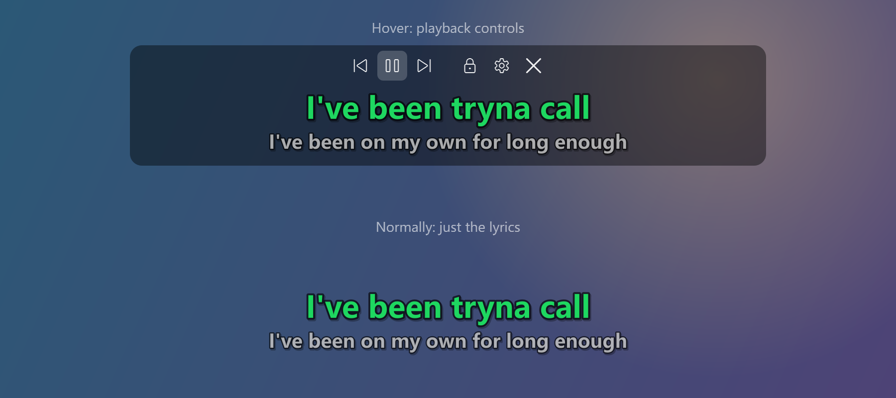

# Spotify Desktop Lyrics

**English** | [简体中文](README.zh-CN.md)

Desktop lyrics for the Spotify app on Windows.

## Download

1. Download `SpotifyLyrics-x.y.z-win64.zip` from the [latest release](../../releases/latest)
2. Unzip it and run `SpotifyLyrics.exe`
3. Play a song in Spotify

If Windows says "Windows protected your PC", click **More info** → **Run anyway**.

## Features

- Lyrics show up automatically while Spotify is open
- Lyrics from QQ Music, NetEase Cloud Music and LRCLIB
- Hover over the lyrics for playback controls; right-click for settings
- A desktop shortcut shows or hides the lyrics in one click
- English and Chinese interface
