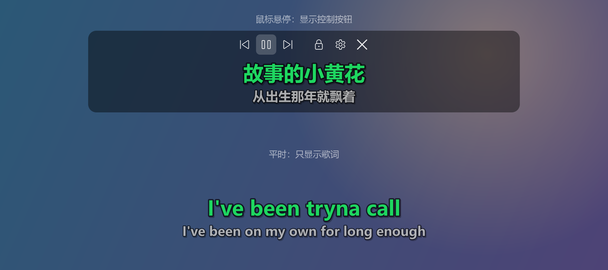

# Spotify 桌面歌词

[English](README.md) | **简体中文**

给 Windows 上的 Spotify 电脑版加桌面歌词。

## 下载

1. 到[最新版本](../../releases/latest)下载 `SpotifyLyrics-x.y.z-win64.zip`
2. 解压后双击 `SpotifyLyrics.exe`
3. 在 Spotify 里放首歌

如果 Windows 提示「Windows 已保护你的电脑」，点「更多信息」→「仍要运行」。

## 功能

- Spotify 打开时自动显示歌词，外文歌附中文翻译
- 歌词来自 QQ 音乐、网易云音乐和 LRCLIB
- 鼠标移到歌词上出现播放控制按钮，右键打开设置
- 桌面快捷方式，点一下显示或隐藏歌词
- 中英文界面（菜单里的 Language / 语言 切换）
